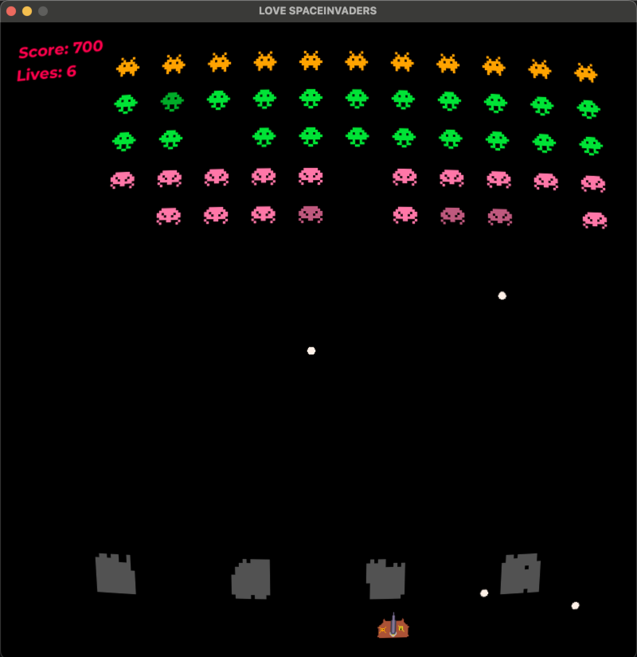

# Love Space Invaders
Space Invaders is a 1978 shoot 'em up arcade game developed by Tomohiro Nishikado. This is clone with new addons.

## Screenshots

## Addons
* [LÖVE](https://love2d.org) framework official website
* [OOO library](https://github.com/rxi/classic)
* [Input library](https://github.com/a327ex/boipushy)
* [Shader library](https://github.com/vrld/moonshine)
